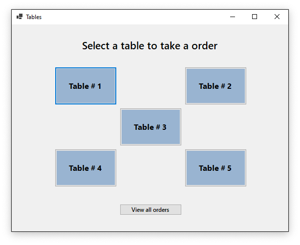
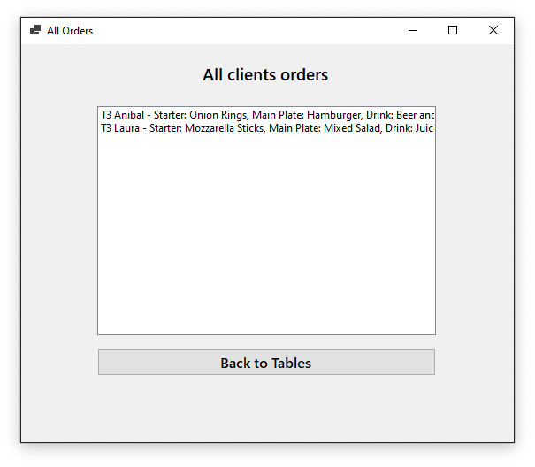
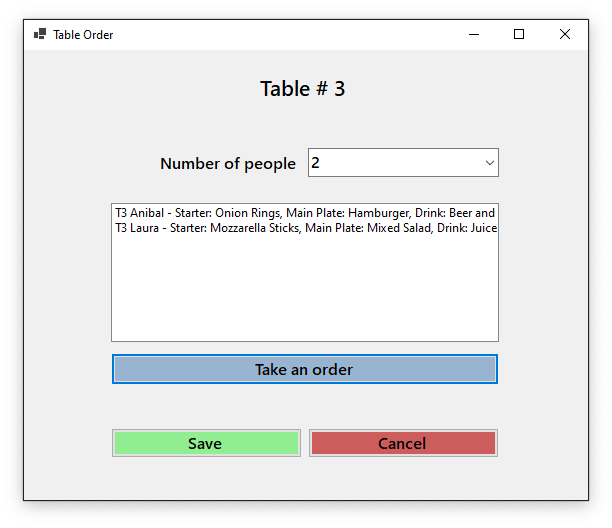
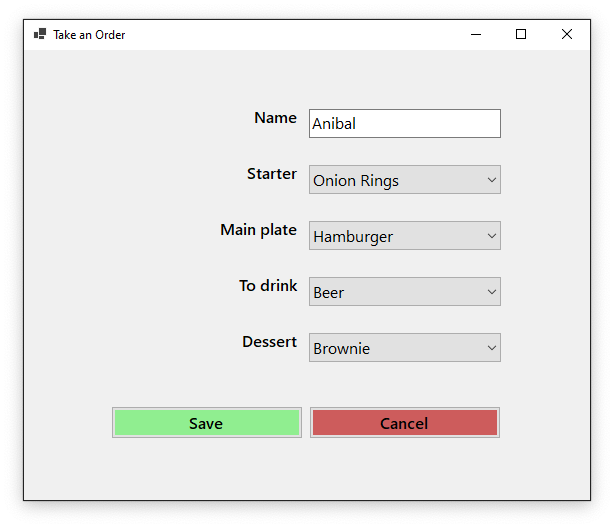

# Restaurant Order Taker

[](https://dotnet.microsoft.com)
[](LICENCE.md)

<p align="center">
  
  
  
  
</p>

WinForm app to take orders in a restaurant, written in .NET using OOP.

## Features

- Tables screen.
  - Five tables.
  - Button to see screen with all orders taken.
- Table order screen.
  - Select number of people per table (min 1 - max 4).
  - See all orders taken in a table.
  - Message warning to only take orders for number of people in table.
  - Save button to save all orders.
  - Cancel button to dismiss all orders.
- Take order screen.
  - Take a order with 5 options.
  - Warnings when save with an empty field.
  - Save button that save specific order.
  - Cancel button to dismiss order.

## License

```xml
MIT License

Copyright (c) 2021 Anibal Ventura
```
